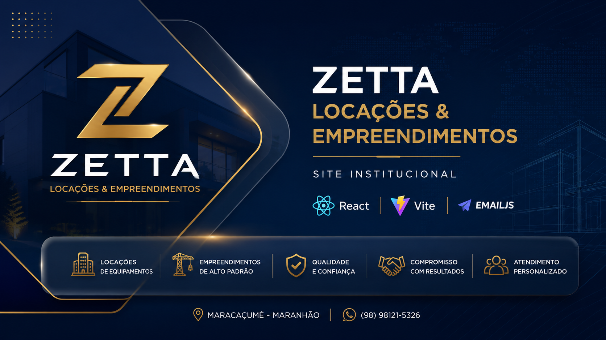

# Zetta Locações & Empreendimentos

### Site Institucional Oficial

---

## 🚀 Sobre o projeto

O **Zetta Locações & Empreendimentos** é um site institucional desenvolvido em React + Vite para apresentar os serviços da empresa com uma interface moderna, responsiva e otimizada para desempenho.

### Principais recursos

- Interface moderna
- Layout responsivo
- Efeito Glassmorphism
- Animações com Framer Motion
- Integração com EmailJS
- Google Maps
- Botão para WhatsApp
- Link para Instagram
- Estrutura preparada para SEO